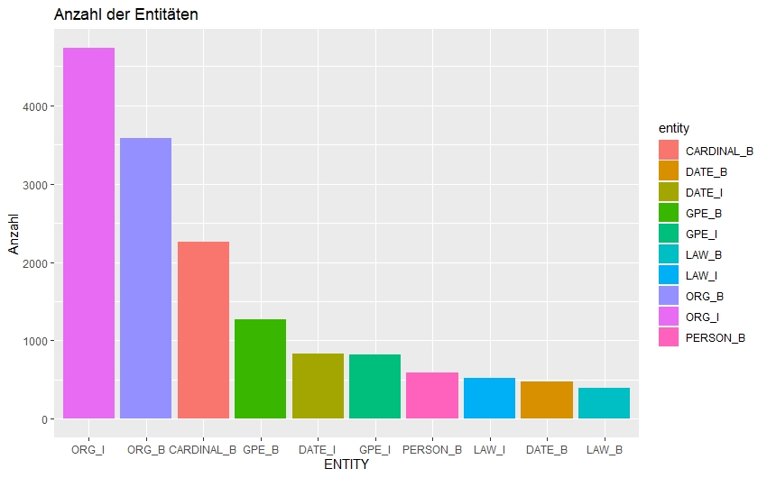

---

title:        NLP - Konzept und Idee 
author:       Yohan Park
tags:         NLP, Textmining

---

# NLP - Konzept und Idee:

- [Datensicht](#datensicht)
  - [Gegenstand der Daten](#gegenstand-der-daten)
  - [Fragestellung](#fragestellung)
  - [Weitere Überlegungen](#weitere-überlegungen)
  
- [Methodische Sicht](#methodische-sicht)
  - [Named Entity Recognition](#named-entity-recognition)
  - [Text Klassifikation](#text-klassifikation)
  
## Datensicht
### Gegenstand der Daten

* Historische Verfassungstexte der Kolonien im ehemaligen britischen Empire bzw. Mitgliedstaaten des Commonwealth.
* Dateiformat: Plain text

### Fragestellung 

* Inwieferen unterscheiden sich die Gesetztexte voneinander? 
  * mögliche Adaption der britischen Verfassung ? 
  * (kulturelle) Einflüsse auf die ehm. Kolonialländer?
  
### Weitere Überlegungen

* Aufbereitung der weiteren Daten 
  * Beispiel Hongkong 
  * [Hong Kong Royal Instructions 1917][^1]
  
  
* Eventuelle Kategorisierung der Daten nach Kontinent? 
  * Führt zur Verbesserung der Übersichtlichkeit der Daten

## Methodische Sicht
  
### Named Entity Recognition
  
* Automatische Erkennung der klar benennbaren Elementen: 
  * Personen (Angela Merkel, Donald Trump)
  * Orte (Mainz, Darmstadt)
  * Organisationen (UNO, UNESCO)
  * ETC... 
  
  
  
* Library für NER: 
  * Stanford Named Entity Tagger
  * Spacy [2]
  * Blackstone (Spacy-Modell)

* HowTo:

  * Plaintext-Dateien importieren  
  * Umwandlung des Dateiformats in Tidytext-Format 
    * Dataframe, in dem pro Zeile nur ein Token (z.B. Wort) steht.
  
```
mycorpus_tidy <-tidy(mycorpus) 

```
  
  

  ### Text Klassifikation
  
  

  [1] : https://en.wikisource.org/wiki/Hong_Kong_Royal_Instructions_1917
  
  [2] : https://spacy.io/

