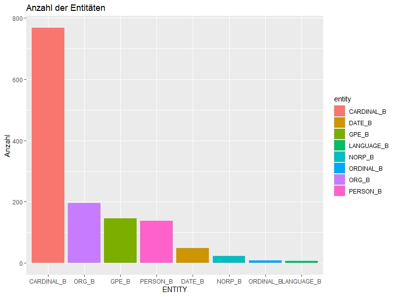

---

title:        NLP - Konzept und Idee 
author:       Yohan Park
tags:         NLP, Textmining

---

# NLP - Konzept und Idee:

- [Datensicht](#datensicht)
  - [Gegenstand der Daten](#gegenstand-der-daten)
  - [Fragestellung](#fragestellung)
  - [Weitere Überlegungen](#weitere-überlegungen)
  
- [Methodische Sicht](#methodische-sicht)
  - [Named Entity Recognition](#named-entity-recognition)
  - [Text Klassifikation](#text-klassifikation)
  
## Datensicht
### Gegenstand der Daten

* Historische Verfassungstexte der Kolonien im ehemaligen britischen Empire bzw. Mitgliedstaaten des Commonwealth.
* Dateiformat: Plain text

### Fragestellung 

* Inwieferen unterscheiden sich die Gesetztexte voneinander? 
  * mögliche Adaption der britischen Verfassung ? 
  * (kulturelle) Einflüsse auf die ehm. Kolonialländer?
  
### Weitere Überlegungen

* Aufbereitung der weiteren Daten 
  * Beispiel Hongkong 
  * [Hong Kong Royal Instructions 1917][1]
  
  
* Eventuelle Kategorisierung der Daten nach Kontinent? 
  * Führt zur Verbesserung der Übersichtlichkeit der Daten

## Methodische Sicht
  
### Named Entity Recognition
  
* Automatische Erkennung der klar benennbaren Elementen: 
  * Personen (Angela Merkel, Donald Trump)
  * Orte (Mainz, Darmstadt)
  * Organisationen (UNO, UNESCO)
  * ETC... 
  
  
  
* Library für NER: 
  * Stanford Named Entity Tagger
  * Spacy [2]
  * Blackstone (Spacy-Modell)

* HowTo:

  * Plaintext-Dateien importieren  
  * Umwandlung des Dateiformats in Tidytext-Format 
    * Tidytext: Dataframe, in dem pro Zeile nur ein Token (z.B. Wort) steht.
  * Annotation der Entitäten durch SpaCy-Parser
  * Extraktion der Entitäten
  ```
  mycorpus_tidy <-tidy(mycorpus) 

  corpus_spacyr <- mycorpus_tidy %>% 
    unnest_tokens(word, text) %>% 
    anti_join(stop_words) %>% 
    count(title, word, sort=TRUE)%>%
    mutate(ner = map(word, ~spacy_parse(., entity = TRUE)))
  
  entity_df <- corpus_spacyr %>% 
    select(word, ner) %>% 
    mutate(entity = map(ner, ~ count(., entity, sort = TRUE) )) %>% 
    unnest(entity)
  ```
  * Zusammenfassung der erkannten Entitäten
  ```
  entity_df %>% 
    group_by(entity) %>% 
    summarise(entity_sum = sum(n)) %>% 
    arrange(desc(entity_sum)) %>% 
   filter(entity != "")
   
  # A tibble: 8 x 2
    entity     entity_sum
    <chr>           <int>
  1 CARDINAL_B        768
  2 ORG_B             196
  3 GPE_B             145
  4 PERSON_B          137
  5 DATE_B             48
  6 NORP_B             23
  7 ORDINAL_B           9
  8 LANGUAGE_B          6

  ```
    * Visualisierung 
  ```
  entity_df %>% 
   group_by(entity) %>% 
    summarise(entity_sum = sum(n)) %>% 
    arrange(desc(entity_sum)) %>% 
    filter(entity != "") %>%
    ggplot(., aes(reorder(entity, -entity_sum), entity_sum, fill = entity)) +
    geom_bar(stat = "identity") +
    labs(x = "ENTITY", y = "Anzahl")  +
    ggtitle("Anzahl der Entitäten")
  ```
  
  
  
  * Extraktion der einzelnen Entitäten ("GPE", "PERSON", "NORP", "ORDINAL", "LANGUAGE","ORG")
  
  ```
  Entitity_df <- corpus_spacyr %>% 
  mutate(ent = map(ner, ~ filter(., str_detect(entity, paste(c("GPE", "PERSON", "NORP", "ORDINAL", "LANGUAGE","ORG"),collapse = '|'))) )) %>% 
  unnest(ent)
  ```

  ### Text Klassifikation
  
  

  [1] : https://en.wikisource.org/wiki/Hong_Kong_Royal_Instructions_1917
  
  [2] : https://spacy.io/

